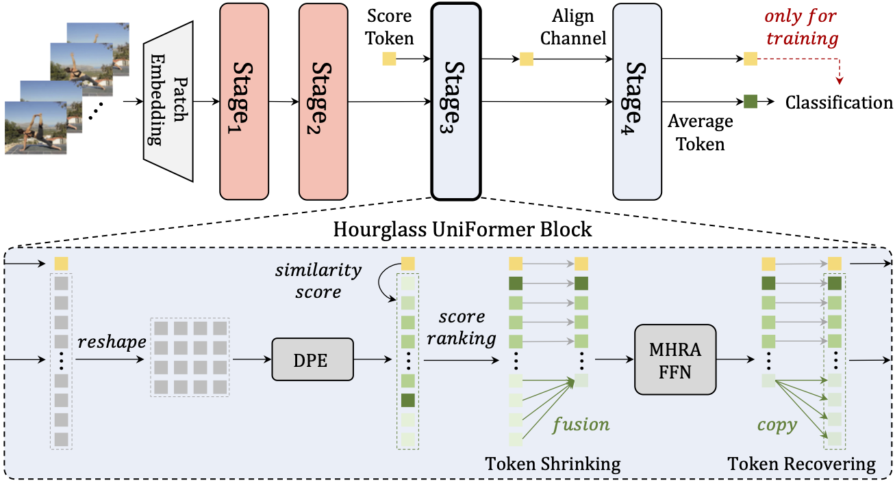
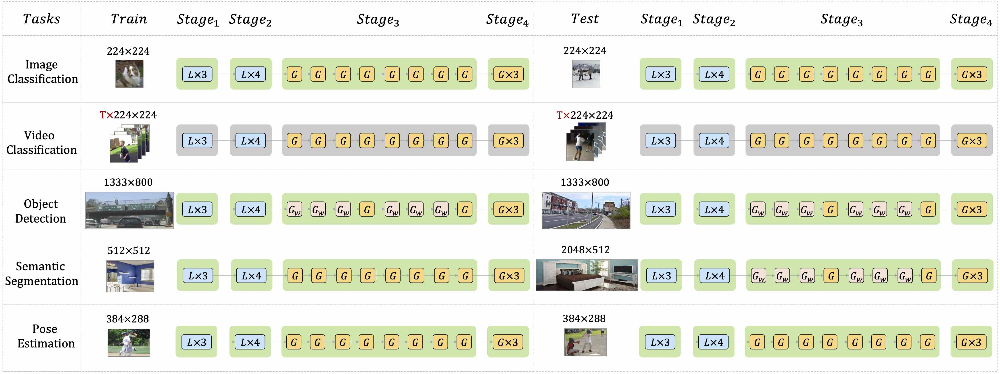

# UniFormer
<a src="https://img.shields.io/badge/%F0%9F%A4%97-Open%20in%20Spaces-blue" href="https://huggingface.co/spaces/Andy1621/uniformer_light ">
    
</a> 
<a src="https://img.shields.io/badge/cs.CV-2305.06355-b31b1b?logo=arxiv&logoColor=red" href="https://arxiv.org/abs/2201.09450"> 
    
</a> 
<a src="https://img.shields.io/badge/cs.CV-2305.06355-b31b1b?logo=arxiv&logoColor=red" href="https://arxiv.org/abs/2201.04676"> 
   
</a>

### 💬 This repo is the official implementation of:
- ***TPAMI2023***: [UniFormer: Unifying Convolution and Self-attention for Visual Recognition](https://arxiv.org/abs/2201.09450) 
- ***ICLR2022***: [UniFormer: Unified Transformer for Efficient Spatiotemporal Representation Learning](https://arxiv.org/abs/2201.04676)

### 🤖 It currently includes code and models for the following tasks:
- [x] [Image Classification](image_classification)
- [x] [Video Classification](video_classification)
- [x] [Object Detection](object_detection)
- [x] [Semantic Segmentation](semantic_segmentation)
- [x] [Pose Estimation](pose_estimation)
- [x] **Lightweght Model** (see `exp_light` in each task)

### 🌟 Other popular repos:
- [UniFormerV2](https://github.com/OpenGVLab/UniFormerV2): The first model to achieve 90% top-1 accuracy on Kinetics-400.
- [Unmasked Teacher](https://github.com/OpenGVLab/unmasked_teacher): Using only public sources for pre-training in 6 days on 32 A100 GPUs, our scratch-built ViT-L/16 achieves state-of-the-art performances on various video tasks.
- [Ask-Anything](https://github.com/OpenGVLab/Ask-Anything/tree/main): Ask anything in video and image!


## ⚠️ Note!!!!!

For downstream tasks:

- We forget to **freeze BN in backbone**, which will further improve the performance.
- We have verified that **Token Labeling can largely help the downstream tasks**. Have a try if you utilize UniFormer for competition or application.
- The `head_dim` of some models are `32`, which will lead to **large memory cost but little improvement for downstream tasks**. Those models with `head_dim=64` are released released in [image_classification](image_classification).

## 🔥 Updates


***05/19/2023***

The extension version has been accepted by IEEE Transactions on Pattern Analysis and Machine Intelligence (***TPAMI***) 🎉🎉🎉. In revision, we explore the simple yet effective lightweight design: **Hourglass UniFormer**. Based on that, we propose the efficient UniFormer-XS and UniFormer-XXS:

- For image tasks, they surpass [MobileViT](https://arxiv.org/abs/2110.02178), [PVTv2](https://arxiv.org/abs/2106.13797) and [EfficientNet](https://arxiv.org/abs/1905.11946).
- For video tasks, they surpass [X3D](https://arxiv.org/abs/2004.04730) and [MoViNet](https://arxiv.org/abs/2103.11511).
- Try our [🚀fast demo🚀](https://huggingface.co/spaces/Andy1621/uniformer_light) on CPU!


***11/20/2022***

We have released [UniFormerV2](https://github.com/OpenGVLab/UniFormerV2), which aims to arming the pre-trained ViTs with efficient UniFormer designs. It can save a lot of reaining resources and achieve powerful performance on 8 popular benchmarks. Please have a try! 🎉🎉

***10/26/2022***

We have provided the code for video visualizations, please see [video_classification/vis](./video_classification/vis).


***05/24/2022***

1. Some bugs for video recognition have been fixed in [Nightcrawler](https://github.com/Andy1621/Nightcrawler). We successfully adapt UniFormer for [extreme dark video classification](https://codalab.lisn.upsaclay.fr/competitions/1112#results)! 🎉🎉
2. More demos for [Detection](https://huggingface.co/spaces/Andy1621/uniformer_image_detection) and [Segmentation](https://huggingface.co/spaces/Andy1621/uniformer_image_segmentation) are provided. 👏😄

***03/6/2022***

Some models with `head_dim=64` are released, which can save memory cost for downstream tasks.

***02/9/2022***

Some popular models and demos are updated in [hugging face](https://huggingface.co/Sense-X).

***02/3/2022***

Integrated into [](https://huggingface.co/spaces) using [Gradio](https://github.com/gradio-app/gradio). Have fun!
- [Image Demo](https://huggingface.co/spaces/Sense-X/uniformer_image_demo)
- [Video Demo](https://huggingface.co/spaces/Sense-X/uniformer_video_demo)

***01/21/2022***

[UniFormer for video](https://openreview.net/forum?id=nBU_u6DLvoK) is accepted by **ICLR2022 (8868, Top 3%**)!

***01/19/2022***

1. Pretrained models on ImageNet-1K with [Token Labeling](https://arxiv.org/abs/2104.10858).
2. Large resolution fine-tuning.

***01/18/2022***

1. The supported code and models for COCO object detection.
2. The supported code and models for ADE20K semantic segmentation.
3. The supported code and models for COCO pose estimation.

***01/13/2022***

1. Pretrained models on ImageNet-1K, Kinetics-400, Kinetics-600, Something-Something V1&V2.

2. The supported code and models for image classification and video classification are provided.

   

## 📖 Introduction

**UniFormer** (**Uni**fied trans**Former**) is introduce in [arxiv](https://arxiv.org/abs/2201.04676) (more details can be found in [arxiv](https://arxiv.org/abs/2201.09450)), which can seamlessly integrate merits of convolution and self-attention in a concise transformer format. We adopt local MHRA in shallow layers to largely reduce computation burden and global MHRA in deep layers to learn global token relation. 

Without any extra training data, our UniFormer achieves **86.3** top-1 accuracy on ImageNet-1K classification. With only ImageNet-1K pre-training, it can simply achieve state-of-the-art performance in a broad range of downstream tasks. Our UniFormer obtains **82.9/84.8** top-1 accuracy on Kinetics-400/600, and **60.9/71.2** top-1 accuracy on Something-Something V1/V2 video classification tasks. It also achieves **53.8** box AP and **46.4** mask AP on COCO object detection task, 50.8 mIoU on ADE20K semantic segmentation task, and **77.4** AP on COCO pose estimation task. Moreover, we build an efficient UniFormer with a concise hourglass design of token shrinking and recovering, which achieves **2-4×** higher throughput than the recent lightweight models.

<div align=center>
    <h3> General Framework </h3>
</div>
<div align="center">
    
</div>
<div align=center>
    <h3> Efficient Framework </h3>
</div>
<div align="center">
    
</div>
<div align=center>
    <h3> Different Downstream Tasks </h3>
</div>
<div align="center">
    
</div>

## Main results on ImageNet-1K

Please see [image_classification](image_classification) for more details.

More models with large resolution and token labeling will be released  soon.

| Model           | Pretrain    | Resolution | Top-1 | #Param. | FLOPs |
| --------------- | ----------- | ---------- | ----- | ------- | ----- |
| UniFormer-XXS   | ImageNet-1K | 128x128    | 76.8  | 10.2M   | 0.43G |
| UniFormer-XXS   | ImageNet-1K | 160x160    | 79.1  | 10.2M   | 0.67G |
| UniFormer-XXS   | ImageNet-1K | 192x192    | 79.9  | 10.2M   | 0.96G |
| UniFormer-XXS   | ImageNet-1K | 224x224    | 80.6  | 10.2M   | 1.3G  |
| UniFormer-XS    | ImageNet-1K | 192x192    | 81.5  | 16.5M   | 1.4G  |
| UniFormer-XS    | ImageNet-1K | 224x224    | 82.0  | 16.5M   | 2.0G  |
| UniFormer-S     | ImageNet-1K | 224x224    | 82.9  | 22M     | 3.6G  |
| UniFormer-S†    | ImageNet-1K | 224x224    | 83.4  | 24M     | 4.2G  |
| UniFormer-B     | ImageNet-1K | 224x224    | 83.9  | 50M     | 8.3G  |
| UniFormer-S+TL  | ImageNet-1K | 224x224    | 83.4  | 22M     | 3.6G  |
| UniFormer-S†+TL | ImageNet-1K | 224x224    | 83.9  | 24M     | 4.2G  |
| UniFormer-B+TL  | ImageNet-1K | 224x224    | 85.1  | 50M     | 8.3G  |
| UniFormer-L+TL  | ImageNet-1K | 224x224    | 85.6  | 100M    | 12.6G |
| UniFormer-S+TL  | ImageNet-1K | 384x384    | 84.6  | 22M     | 11.9G |
| UniFormer-S†+TL | ImageNet-1K | 384x384    | 84.9  | 24M     | 13.7G |
| UniFormer-B+TL  | ImageNet-1K | 384x384    | 86.0  | 50M     | 27.2G |
| UniFormer-L+TL  | ImageNet-1K | 384x384    | 86.3  | 100M    | 39.2G |

## Main results on Kinetics video classification

Please see [video_classification](video_classification) for more details.

| Model       | Pretrain    | #Frame | Sampling Stride | FLOPs | K400 Top-1 | K600 Top-1 |
| ----------- | ----------- | ------ | --------------- | ----- | ---------- | ---------- |
| UniFormer-S | ImageNet-1K | 16x1x4 | 4            | 167G  | 80.8       | 82.8       |
| UniFormer-S | ImageNet-1K | 16x1x4 | 8            | 167G  | 80.8       | 82.7       |
| UniFormer-S | ImageNet-1K | 32x1x4 | 4            | 438G  | 82.0       | -          |
| UniFormer-B | ImageNet-1K | 16x1x4 | 4            | 387G  | 82.0       | 84.0       |
| UniFormer-B | ImageNet-1K | 16x1x4 | 8            | 387G  | 81.7       | 83.4       |
| UniFormer-B | ImageNet-1K | 32x1x4 | 4            | 1036G | 82.9       | 84.5*      |

| Model         | Pretrain    | #Frame | Resolution | FLOPs | K400 Top-1 |
| ------------- | ----------- | ------ | ---------- | ----- | ---------- |
| UniFormer-XXS | ImageNet-1K | 4x1x1  | 128        | 1.0G  | 63.2       |
| UniFormer-XXS | ImageNet-1K | 4x1x1  | 160        | 1.6G  | 65.8       |
| UniFormer-XXS | ImageNet-1K | 8x1x1  | 128        | 2.0G  | 68.3       |
| UniFormer-XXS | ImageNet-1K | 8x1x1  | 160        | 3.3G  | 71.4       |
| UniFormer-XXS | ImageNet-1K | 16x1x1 | 128        | 4.2G  | 73.3       |
| UniFormer-XXS | ImageNet-1K | 16x1x1 | 160        | 6.9G  | 75.1       |
| UniFormer-XXS | ImageNet-1K | 32x1x1 | 160        | 15.4G | 77.9       |
| UniFormer-XS  | ImageNet-1K | 32x1x1 | 192        | 34.2G | 78.6       |

>  \#Frame = \#input_frame x \#crop x \#clip

\* Since Kinetics-600 is too large to train (>1 month in single node with 8 A100 GPUs), we provide model trained in multi node (around 2 weeks with 32 V100 GPUs), but the result is lower due to the lack of tuning hyperparameters.

\* For UniFormer-XS and UniFormer-XXS, we use sparse sampling.

## Main results on Something-Something video classification

Please see [video_classification](video_classification) for more details.

| Model       | Pretrain | #Frame | FLOPs | SSV1 Top-1 | SSV2 Top-1 |
| ----------- | -------- | ------ | ----- | ---------- | ---------- |
| UniFormer-S | K400     | 16x3x1 | 125G  | 57.2       | 67.7       |
| UniFormer-S | K600     | 16x3x1 | 125G  | 57.6       | 69.4       |
| UniFormer-S | K400     | 32x3x1 | 329G  | 58.8       | 69.0       |
| UniFormer-S | K600     | 32x3x1 | 329G  | 59.9       | 70.4       |
| UniFormer-B | K400     | 16x3x1 | 290G  | 59.1       | 70.4       |
| UniFormer-B | K600     | 16x3x1 | 290G  | 58.8       | 70.2       |
| UniFormer-B | K400     | 32x3x1 | 777G  | 60.9       | 71.1       |
| UniFormer-B | K600     | 32x3x1 | 777G  | 61.0       | 71.2       |

> \#Frame = \#input_frame x \#crop x \#clip

## Main results on UCF101 and HMDB51 video classification

Please see [video_classification](video_classification) for more details.

| Model       | Pretrain    | #Frame | Sampling Stride | FLOPs | UCF101 Top-1 | HMDB51 Top-1 |
| ----------- | ----------- | ------ | --------------- | ----- | ---------- | ---------- |
| UniFormer-S | K400 | 16x3x5 | 4            | 625G  | 98.3       | 77.5       |

> \#Frame = \#input_frame x \#crop x \#clip

\* We only report the results in the first split. As for the results in our paper, we run the model in 3 training/validation splits and average the results.


## Main results on COCO object detection

Please see [object_detection](object_detection) for more details.

### Mask R-CNN

|         Backbone          | Lr Schd | box mAP | mask mAP | #params | FLOPs |
| :--------------- | :----- | :----- | :------ | :----- | :--- |
| UniFormer-XXS             |   1x    |  42.8   |   39.2   |   29.4M | -  |
| UniFormer-XS              |   1x    |  44.6   |   40.9   |   35.6M | -  |
| UniFormer-S<sub>h14</sub> |   1x    |  45.6   |   41.6   |   41M   | 269G  |
| UniFormer-S<sub>h14</sub> |  3x+MS  |  48.2   |   43.4   |   41M   | 269G  |
| UniFormer-B<sub>h14</sub> |   1x    |  47.4   |   43.1   |   69M   | 399G  |
| UniFormer-B<sub>h14</sub> |  3x+MS  |  50.3   |   44.8   |   69M   | 399G  |

\* The FLOPs are measured at resolution 800×1280.

### Cascade Mask R-CNN

|         Backbone          | Lr Schd | box mAP | mask mAP | #params | FLOPs |
| :----------------------- | :----- | :----- | :------ | :----- | :--- |
| UniFormer-S<sub>h14</sub> |  3x+MS  |  52.1   |   45.2   |   79M   | 747G  |
| UniFormer-B<sub>h14</sub> |  3x+MS  |  53.8   |   46.4   |  107M   | 878G  |

\* The FLOPs are measured at resolution 800×1280.

## Main results on ADE20K semantic segmentation

Please see [semantic_segmentation](semantic_segmentation) for more details.

### Semantic FPN

|         Backbone          | Lr Schd | mIoU | #params | FLOPs |
| :------------------- | :----- | :-- | :----- | :--- |
| UniFormer-XXS             |   80K   | 42.3 |   13.5M | -  |
| UniFormer-XS              |   80K   | 44.4 |   19.7M | -  |
| UniFormer-S<sub>h14</sub> |   80K   | 46.3 |   25M   | 172G  |
| UniFormer-B<sub>h14</sub> |   80K   | 47.0 |   54M   | 328G  |
| UniFormer-S<sub>w32</sub> |   80K   | 45.6 |   25M   | 183G  |
| UniFormer-S<sub>h32</sub> |   80K   | 46.2 |   25M   | 199G  |
| UniFormer-S               |   80K   | 46.6 |   25M   | 247G  |
| UniFormer-B<sub>w32</sub> |   80K   | 47.0 |   54M   | 310G  |
| UniFormer-B<sub>h32</sub> |   80K   | 47.7 |   54M   | 350G  |
| UniFormer-B               |   80K   | 48.0 |   54M   | 471G  |

\* The FLOPs are measured at resolution 512×2048.

### UperNet

|         Backbone          | Lr Schd | mIoU | MS mIoU | #params | FLOPs |
| :----------------------- | :----- | :-- | :----- | :----- | :--- |
| UniFormer-S<sub>h14</sub> |  160K   | 46.9 |  48.0   |   52M   | 947G  |
| UniFormer-B<sub>h14</sub> |  160K   | 48.9 |  50.0   |   80M   | 1085G |
| UniFormer-S<sub>w32</sub> |  160K   | 46.6 |  48.4   |   52M   | 939G  |
| UniFormer-S<sub>h32</sub> |  160K   | 47.0 |  48.5   |   52M   | 955G  |
|       UniFormer-S       |  160K   | 47.6 |  48.5   |   52M   | 1004G |
|  UniFormer-B<sub>w32</sub>  |  160K   | 49.1 |  50.6   |   80M   | 1066G |
| UniFormer-B<sub>h32</sub> |  160K   | 49.5 |  50.7   |   80M   | 1106G |
|  UniFormer-B  |  160K   | 50.0 |  50.8   |   80M   | 1227G |

\* The FLOPs are measured at resolution 512×2048.

## Main results on COCO pose estimation

Please see [pose_estimation](pose_estimation) for more details.

### Top-Down

|        Backbone         | Input Size |  AP  | AP<sup>50</sup> | AP<sup>75</sup> | AR<sup>M</sup> | AR<sup>L</sup> |  AR  | FLOPs |
| :--------------------- | :-------- | :-- | :------------- | :------------- | :------------ | :------------ | :-- | :----- |
| UniFormer-S |  256x192   | 74.0 |      90.3       |      82.2       |      66.8      |      76.7      | 79.5 | 4.7G  |
| UniFormer-S |  384x288   | 75.9 |      90.6       |      83.4       |      68.6      |      79.0      | 81.4 | 11.1G |
| UniFormer-S |  448x320   | 76.2 |      90.6       |      83.2       |      68.6      |      79.4      | 81.4 | 14.8G |
| UniFormer-B |  256x192   | 75.0 |      90.6       |      83.0       |      67.8      |      77.7      | 80.4 | 9.2G  |
| UniFormer-B |  384x288   | 76.7 |      90.8       |      84.0       |      69.3      |      79.7      | 81.4 | 14.8G |
| UniFormer-B |  448x320   | 77.4 |      91.1       |      84.4       |      70.2      |      80.6      | 82.5 | 29.6G |


## ⭐ Cite Uniformer

If you find this repository useful, please give us stars and use the following BibTeX entry for citation.

```latex
@misc{li2022uniformer,
      title={UniFormer: Unifying Convolution and Self-attention for Visual Recognition}, 
      author={Kunchang Li and Yali Wang and Junhao Zhang and Peng Gao and Guanglu Song and Yu Liu and Hongsheng Li and Yu Qiao},
      year={2022},
      eprint={2201.09450},
      archivePrefix={arXiv},
      primaryClass={cs.CV}
}
```

```latex
@misc{li2022uniformer,
      title={UniFormer: Unified Transformer for Efficient Spatiotemporal Representation Learning}, 
      author={Kunchang Li and Yali Wang and Peng Gao and Guanglu Song and Yu Liu and Hongsheng Li and Yu Qiao},
      year={2022},
      eprint={2201.04676},
      archivePrefix={arXiv},
      primaryClass={cs.CV}
}
```

## License

This project is released under the MIT license. Please see the [LICENSE](LICENSE) file for more information.

## Contributors and Contact Information

UniFormer is maintained by Kunchang Li.

For help or issues using UniFormer, please submit a GitHub issue.

For other communications related to UniFormer, please contact Kunchang Li (`kc.li@siat.ac.cn`). 
